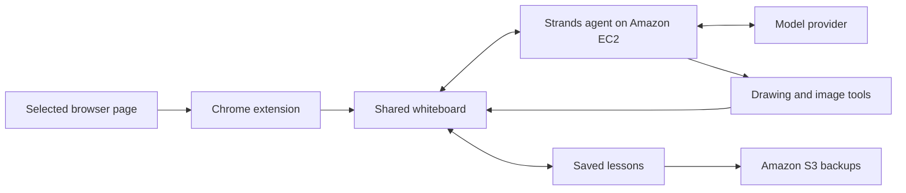

# Alongside

A learning partner that draws with you beside the page you are reading.

Ask about a YouTube lecture, GitHub pull request, or any topic. Alongside builds
an editable whiteboard explanation. Pause, move a shape, ask a follow-up, and
return to saved lessons.

Built with **Strands Agents SDK**, React, and Excalidraw for Agents for Humans.

## Live demo

[Open Alongside](https://alongside.184.73.112.43.sslip.io) with a demo access code.
The hosted app runs Strands on Amazon EC2, with Amazon S3 backups and
AWS Secrets Manager for credentials.

## Features

- Chrome side panel with context from the selected page.
- Progressive drawing, editable shapes, images, and notes.
- Follow-up questions and separate teaching steps.
- Saved lessons and an optional agent activity panel.
- Full-page whiteboard for questions without a browser source.

## Run locally

Requires Node.js 24, Docker, Chrome, and an OpenAI API key.

```sh
git clone https://github.com/SinghCoder/alongside.git
cd alongside
npm ci
npm run setup
cp .env.example .env.local
npm run sandbox:build
```

Set `OPENAI_API_KEY` and a supported `OPENAI_MODEL` in `.env.local`, then run:

```sh
npm run dev -- --port 5176 --strictPort
```

Open **http://127.0.0.1:5176/**. Setup includes 12 original architecture symbols.

Image search is optional. Use `SEARCHAPI_API_KEY` for SearchApi.io,
`BRAVE_SEARCH_API_KEY` for Brave, or `SERPAPI_API_KEY` for SerpApi.com.
SearchApi.io and SerpApi.com are different services.

If using Colima without a working host socket, set
`ALONGSIDE_CONTAINER_CLI=colima` and build the sandbox with:

```sh
colima ssh -- docker build -t alongside-lesson:1 "$PWD/sandbox/lesson"
```

The checkout must be mounted into the VM.

## Connect Chrome

1. Open `chrome://extensions` and enable **Developer mode**.
2. Choose **Load unpacked** and select the `extension` directory.
3. Open a YouTube video or GitHub PR and click Alongside's icon.
   The extension defaults to the hosted app. For local development, change its
   app address to `http://127.0.0.1:5176`.
4. Ask a question. Close Activity for more drawing space.

Open YouTube's **Show transcript** panel if the transcript is unavailable.
On GitHub, load the relevant diffs. Click the extension again after navigating
to another source page. See [extension instructions](extension/README.md).

## Architecture



Strands maintains the lesson conversation and coordinates tools. Alongside
provides page context, the editable board, and saved teaching steps.

## Host on AWS

The production entry point is `npm start`. On an EC2 Linux instance, install
Node.js 24 and Docker, then run `npm ci`, `npm run setup`,
`npm run sandbox:build`, and `npm run build`.

Store a JSON configuration in Secrets Manager containing the variables from
`.env.example`, plus `ALONGSIDE_ACCESS_CODE`, `ALONGSIDE_COOKIE_SECRET`,
`ALONGSIDE_ORIGIN_SECRET`, and `ALONGSIDE_PUBLIC_ORIGIN`. Generate distinct,
random secrets. Set `AWS_REGION`, `ALONGSIDE_SECRET_ARN`, and an absolute
`ALONGSIDE_DATA_DIR` in the service environment. Give its instance role read
access to that secret.

Serve `dist/` over HTTPS. Proxy `/api/*` to the Node service on port 8080,
injecting `X-Alongside-Origin` with the configured origin secret. Keep port 8080
private and disable proxy buffering for streaming. Back up the data directory
to a private S3 bucket. For another hostname, update `extension/origins.js` and
the matching origins in `extension/manifest.json`, then reload the extension.

## Tests

```sh
npm test
npm run build
npx playwright install chromium
npm run test:panel
npm run test:extension
```

Browser tests require the app on port 5176. `npm run test:shell` tests Docker
execution. Optional `RUN_PR_MODEL=1 npm run test:extension` invokes the configured
model and incurs provider usage.

## Data

Lessons are stored locally under `.local/lessons` by default. Back up this folder
to retain your work. Page context is sent to your configured model provider.
Keep API keys server-side; never prefix them with `VITE_`.

The development server is intended for local use. Complex diagrams may need
manual adjustment; reloading interrupts an active explanation but retains saves.

## License

MIT. See [LICENSE](LICENSE) and [third-party notices](THIRD_PARTY_NOTICES.md).
Built using open-source frameworks and AI coding assistance.
